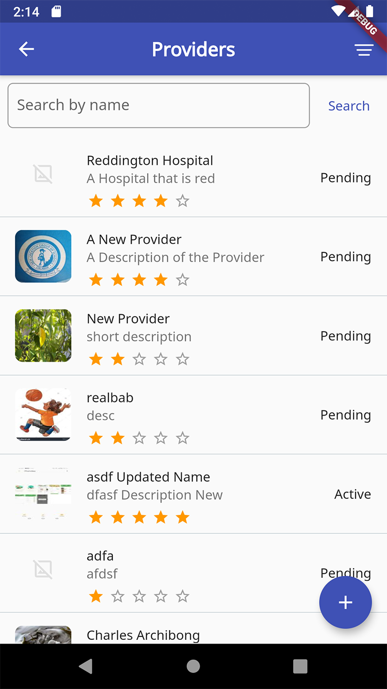
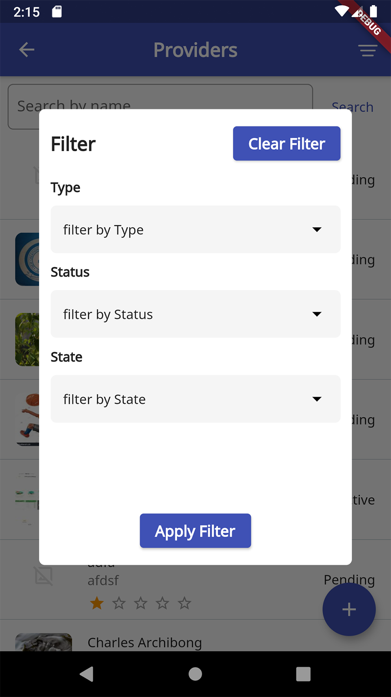
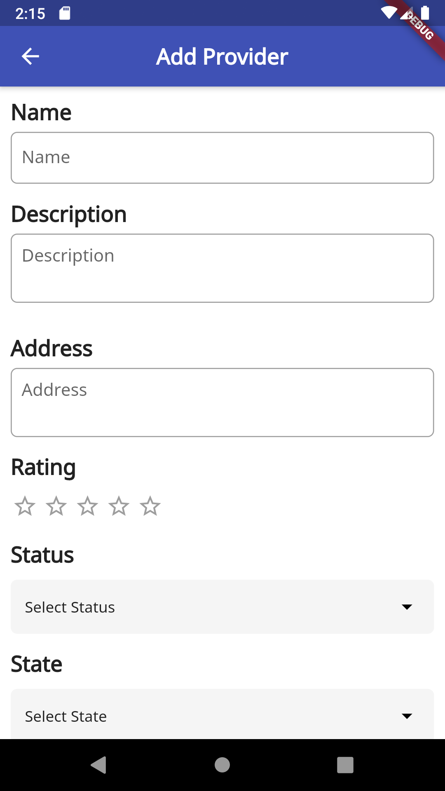
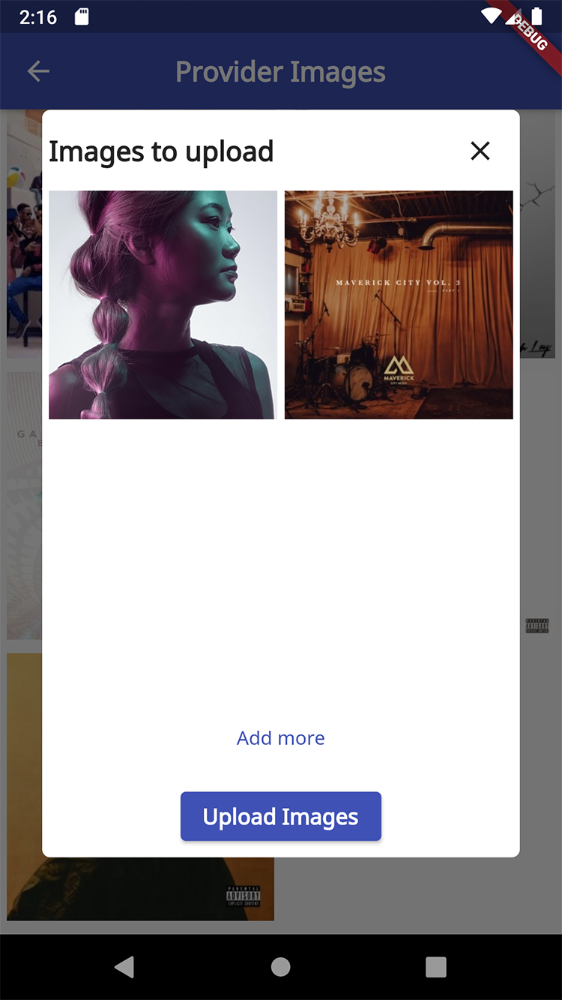

# reliance_prozone

ProZone is a provider aggregator company, that has a large network of healthcare providers (Gym, Spas, Optical Centres, Hospitals etc.) that they work with.

They have provider officers that are responsible for signing up and managing these providers.


## Getting Started
Download dependencies with:
```
flutter pub get
```
And build the app with:
```
flutter run
```


## Screenshots

|       |      |
|      |    |
|       |     |
|       |
